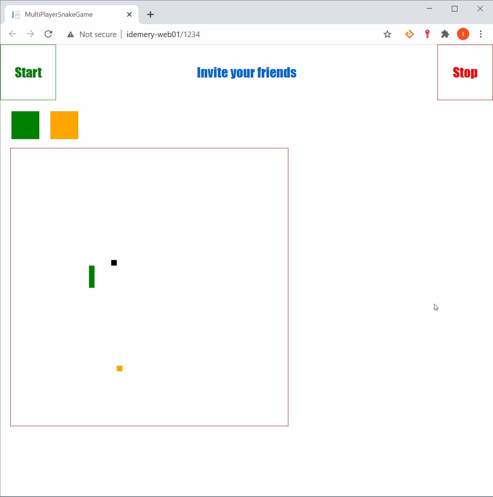

# Multiplayer Snake Game
A multiplayer snake game using .NET 5 Blazor and SignalR that supports rooms and multiple games.

Try the demo [https://blazorsnake.azurewebsites.net](https://blazorsnake.azurewebsites.net) press **Space** to **start** or **stop** the game..



## Introduction
This project is a way to learn Blazor and SignalR, and maybe to show case how using C# instead of Javascript is more easier and simpler. The nuget package [BlazorExtensions Canvas](https://github.com/BlazorExtensions/Canvas) is used for interfacing the HTML canvas.

This project is meant to learn the technology there is no scores counting or game rewards. However, contributions are most welcomed!

## How to play
- Run the demo or run the web application, it's a Blazor hosted on ASP.NET Core so there is 3 projects Client, Server, and Shared. Run the server.
- Press **Space** to **start** or **stop** the game.
- You can play as single or click on Invite your friends after it appears, it will open another page with a query to the same game you started, you may share this URL with your friends to join the same game.
- Press on the arrow keys and target the black sqaure.
- If you loose by hitting the edges, yourself, or an opponent press Space to join again loosing your tail.

## How it works
The **Client** project has just one `Index.razor` page that listens on `'/{GameId?}'` which is an optional parameter property and is considered the SignalR `Group` name. The game generates one if not provided.

This index page uses and handles a `GameClient` instance that acts as proxy to the SignalR hub `GameHub` and fires events when the hub calls the client back.

The hub uses an injected `EngineService` singleton which holds a C# `ConcurrentDictionary<string, Game>` where the key string is GameId (group name).

The game value instance holds a list of players where each player has an `Id` (signalr connection id), `Color` (generated randomly by the client when joining the game for the first time), and `Snake`.

The `Snake` instance holds a C# `LinkedList` that holds nodes of Points where the `Point` is X and Y integer properties.

You can change the speed and canvas size in `Constants.cs`:
``` C#
        public const int CANVAS_WIDTH = 500;
        public const int CANVAS_HEIGHT = 500;
        public const int SNAKE_SIZE = 10;
        public const int TIMER_ELAPSE = 100; // smaller = faster
```

